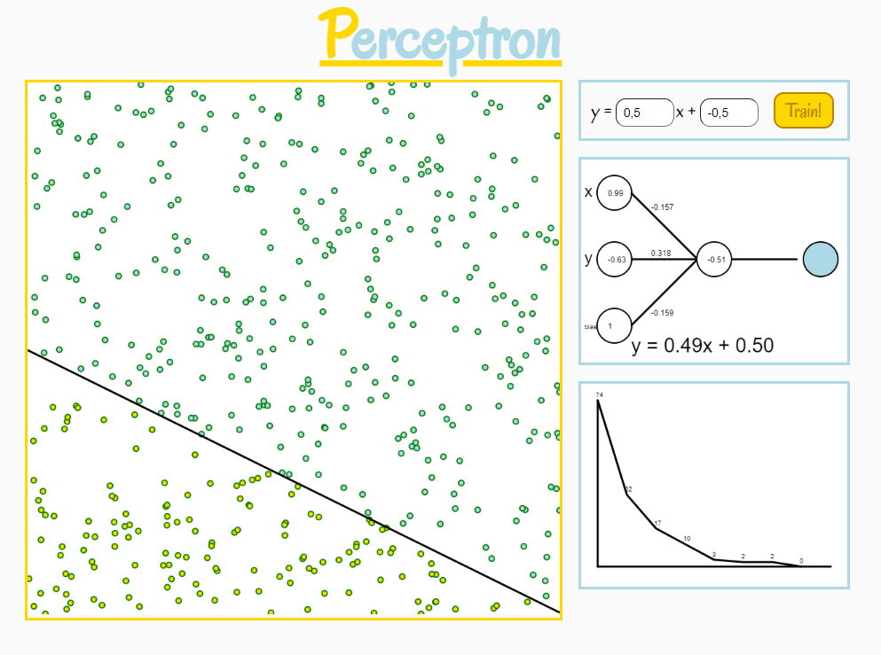

# Perceptron

A perceptron is a single unit of a neural network. On its own it can predict which of
two classes an input is part of, given that the two classes can be separated by a 
single straight line (linear classification).

Our little perceptron is trying to guess the definition of a linear function
(y = mx + b) while only given whether a specific training data point is above or
below the line.

The perceptron can be trained in the browser and its state is visualized at all times.

[**Try it out here!**](https://jbrems.github.io/perceptron/)

## Implementation

This project provides all the code necessary to achieve this and has no dependencies.